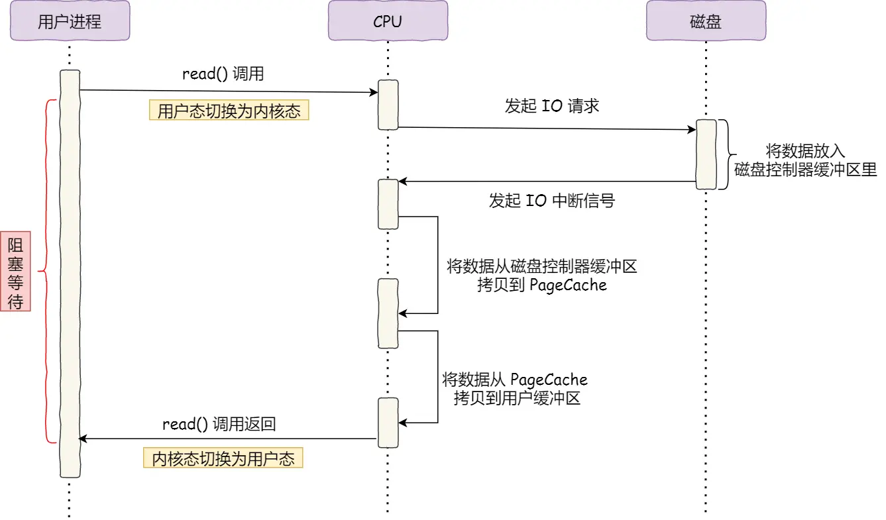
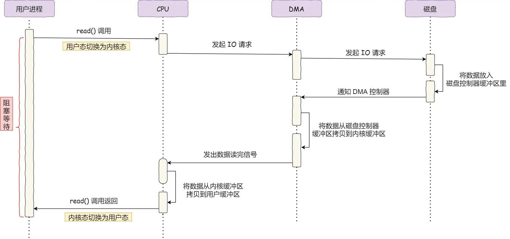
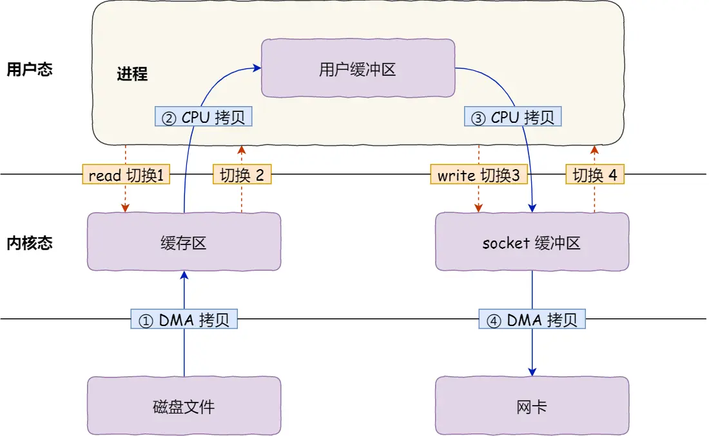
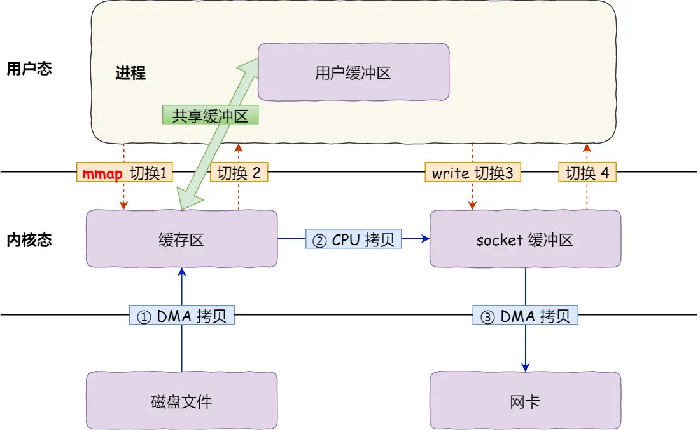
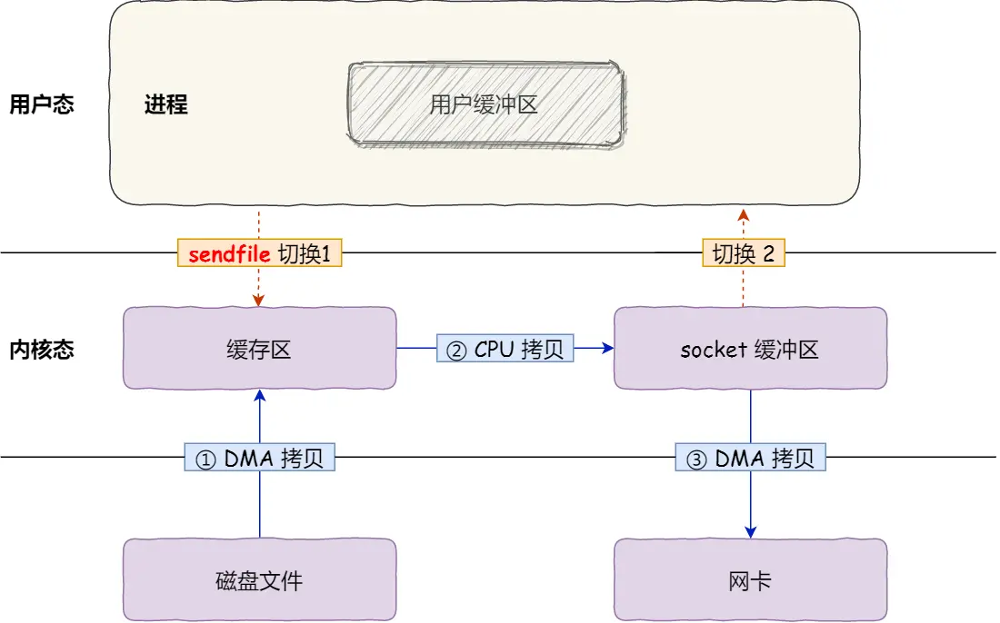
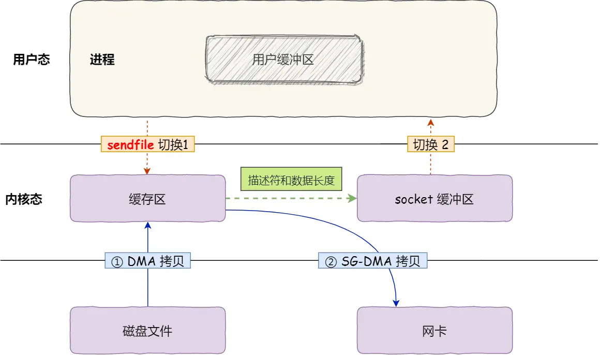
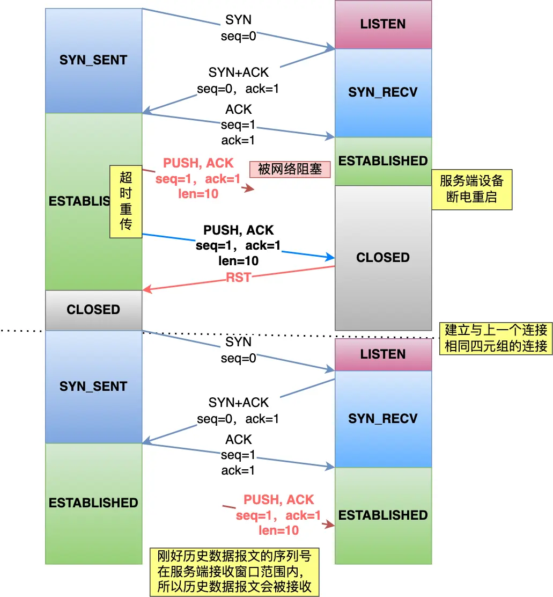
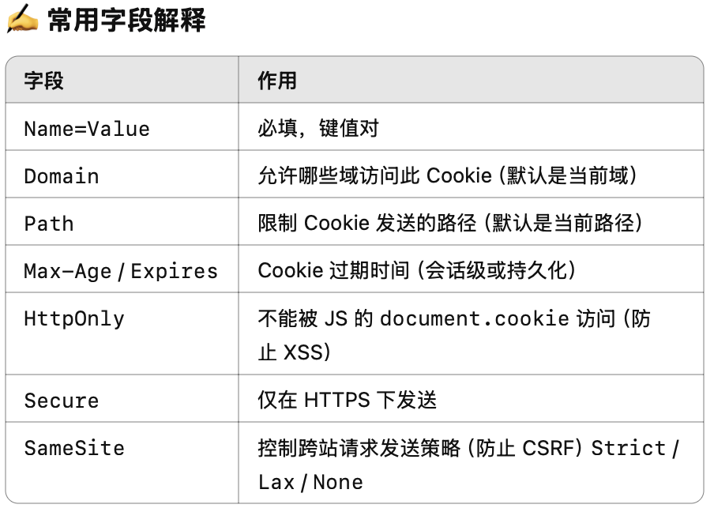

# 计算机网络

## 网络序

网络序是大端序，低字节高地址：0x1234 存放为 12(地址 0) 34(地址 13)

## HTTP 1.0 到 HTTP 3.0

### HTTP 1.0

- 短连接

### HTTP 1.1

- 默认长连接
- 支持管道，客户端不收到响应仍然发送请求（默认禁用，且不支持）
- 引入了更灵活的缓存机制
- 先走强缓存（如果没有过期则直接使用的缓存）再走协商缓存（向服务器询问是否过期的缓存）
- 支持 HOST 字段，多个网站可以共享一个 IP
- 队首阻塞：当一个请求得不到响应，后续的请求都阻塞。

> 在 HTTP/1.0 时代，每个网站通常需要绑定一个独立的 IP 地址，因为 HTTP/1.0 的请求没有 Host 头，服务器无法区分请求是针对哪个站点的。当多个网站共用一个 IP 时，服务器无法确定要返回哪个站点的内容。
> 为了解决这个问题，HTTP/1.1 强制要求所有请求必须包含 Host 头，让服务器能够识别请求目标，进而支持虚拟主机（Virtual Hosting）。

服务器可以根据 Host 头的不同，将请求分发到不同的站点。比如在 Nginx 配置多个虚拟主机：

```nginx
server {
    listen 80;
    server_name www.siteA.com;
    root /var/www/siteA;
}

server {
    listen 80;
    server_name www.siteB.com;
    root /var/www/siteB;
}
```

### HTTP 2.0

- 对 Header 字段进行压缩，引入 静态表、动态表等
  - 比如：Status 200，在静态表中就是一个字节，而原先需要三个字节
- 并发传输，多个 Stream 可以乱序传输，其中一个 Stream 就相当于原先的一个 HTTP 1.1 的请求
- 仍然存在队首阻塞的问题，因为 TCP，当前一个字节没有到达时后续的字节即使到达了也只会被放在内核缓冲区

### HTTP 3.0

- 基于 UDP，在 UDP 的基础上实现 拥塞控制 等机制
- 无队首阻塞
- 集成了 TLS，原先 TCP 三次握手，TLS 四次握手，需要 3 RTT，而集成后只需要 1 RTT，连接建立更快。
- 支持**连接迁移**，QUIC 用 ID 来标识通信的端设备，意味着即使切换网络也能继续通信，不用重连

## HTTPS

## HTTP 与 RPC

- 服务发现：HTTP 基于 DNS，RPC 基于一些成熟的中间件，比如：consul
- 传输的内容：RPC 定制化程度更高，更加紧凑
- 不过 HTTP 2.0 现在性能不俗，gRPC 直接基于 HTTP 2.0

## 网络 IO

> IO 多路复用：在获取事件时，将所有连接传给内核，再由内核返回产生了事件的连接，然后在用户态（程序）中处理

### Select

- 将已连接的 Socket 放到一个**文件描述符集合**，然后调用 `select` 将其传入内核，让内核检查是否有网络事件发生（遍历检查，标记 socket），接着把整个集合拷贝回用户态，用户态还需要再次遍历来寻找可读/写的 socket。
- 涉及两次拷贝和两次遍历，效率低。
- 好处是，通用，适用于小型应用

```c
#include <stdio.h>
#include <stdlib.h>
#include <string.h>
#include <unistd.h>
#include <arpa/inet.h>
#include <sys/types.h>
#include <sys/socket.h>
#include <sys/select.h>

#define PORT 8080
#define MAX_CLIENTS  FD_SETSIZE  // 最大支持的客户端数（通常 1024）

int main() {
    int server_fd, client_fd, max_fd, activity;
    struct sockaddr_in server_addr, client_addr;
    fd_set read_fds, master_fds;
    socklen_t addr_len;
    char buffer[1024];

    // 1. 创建服务器 socket
    server_fd = socket(AF_INET, SOCK_STREAM, 0);
    if (server_fd < 0) {
        perror("Socket failed");
        exit(EXIT_FAILURE);
    }

    // 2. 绑定 IP 和端口
    server_addr.sin_family = AF_INET;
    server_addr.sin_addr.s_addr = INADDR_ANY;
    server_addr.sin_port = htons(PORT);

    if (bind(server_fd, (struct sockaddr*)&server_addr, sizeof(server_addr)) < 0) {
        perror("Bind failed");
        exit(EXIT_FAILURE);
    }

    // 3. 监听连接
    if (listen(server_fd, 5) < 0) {
        perror("Listen failed");
        exit(EXIT_FAILURE);
    }

    printf("Echo server listening on port %d...\n", PORT);

    // 4. 初始化文件描述符集合
    FD_ZERO(&master_fds);
    FD_SET(server_fd, &master_fds);
    max_fd = server_fd; // 记录当前最大的文件描述符

    while (1) {
        read_fds = master_fds; // 复制 fd 集合，避免 `select` 破坏它

        // 5. 使用 `select` 监听所有 fd
        activity = select(max_fd + 1, &read_fds, NULL, NULL, NULL);
        if (activity < 0) {
            perror("Select error");
            continue;
        }

        // 6. 检测服务器 socket 是否有新连接
        if (FD_ISSET(server_fd, &read_fds)) {
            addr_len = sizeof(client_addr);
            client_fd = accept(server_fd, (struct sockaddr*)&client_addr, &addr_len);
            if (client_fd < 0) {
                perror("Accept failed");
                continue;
            }

            printf("New connection from %s:%d\n",
                   inet_ntoa(client_addr.sin_addr),
                   ntohs(client_addr.sin_port));

            FD_SET(client_fd, &master_fds); // 添加新客户端到集合
            if (client_fd > max_fd) {
                max_fd = client_fd; // 更新最大文件描述符
            }
        }

        // 7. 遍历所有 fd，检查是否有数据可读
        for (int fd = server_fd + 1; fd <= max_fd; fd++) {
            if (FD_ISSET(fd, &read_fds)) {
                int bytes_read = read(fd, buffer, sizeof(buffer) - 1);
                if (bytes_read <= 0) {
                    // 客户端断开连接
                    printf("Client disconnected (fd %d)\n", fd);
                    close(fd);
                    FD_CLR(fd, &master_fds);
                } else {
                    // 回显数据
                    buffer[bytes_read] = '\0';
                    printf("Received from client (fd %d): %s", fd, buffer);
                    send(fd, buffer, bytes_read, 0);
                }
            }
        }
    }

    close(server_fd);
    return 0;
}
```

### epoll

- epoll 在内核里维护一个 **红黑树**，避免了来回拷贝文件描述符集合，只传递必要的文件描述符
- 内核维护一个**就绪链表**，当某个 socket 发生事件，内核通过回调将其加入就绪链表，`epoll_wait` 后只返回发生事件的描述符

```c
#include <stdio.h>
#include <stdlib.h>
#include <string.h>
#include <unistd.h>
#include <sys/epoll.h>
#include <sys/socket.h>
#include <arpa/inet.h>
#include <fcntl.h>

#define PORT 8080
#define MAX_EVENTS 1024

// 设置非阻塞模式
void set_nonblocking(int fd) {
    int flags = fcntl(fd, F_GETFL, 0);
    fcntl(fd, F_SETFL, flags | O_NONBLOCK);
}

int main() {
    int server_fd, client_fd, epfd, nfds;
    struct sockaddr_in server_addr, client_addr;
    struct epoll_event ev, events[MAX_EVENTS];
    socklen_t addr_len = sizeof(client_addr);

    // 1. 创建监听 socket
    server_fd = socket(AF_INET, SOCK_STREAM, 0);
    set_nonblocking(server_fd);  // 设置非阻塞模式

    server_addr.sin_family = AF_INET;
    server_addr.sin_addr.s_addr = INADDR_ANY;
    server_addr.sin_port = htons(PORT);

    bind(server_fd, (struct sockaddr*)&server_addr, sizeof(server_addr));
    listen(server_fd, 10);

    // 2. 创建 epoll 实例
    epfd = epoll_create1(0);

    // 3. 添加监听 socket 到 epoll
    ev.events = EPOLLIN;  // 监听可读事件
    ev.data.fd = server_fd;
    epoll_ctl(epfd, EPOLL_CTL_ADD, server_fd, &ev);

    printf("Echo server listening on port %d...\n", PORT);

    while (1) {
        // 4. 等待事件
        nfds = epoll_wait(epfd, events, MAX_EVENTS, -1);

        for (int i = 0; i < nfds; i++) {
            int fd = events[i].data.fd;

            if (fd == server_fd) {
                // 5. 处理新连接
                client_fd = accept(server_fd, (struct sockaddr*)&client_addr, &addr_len);
                set_nonblocking(client_fd);

                ev.events = EPOLLIN | EPOLLET;  // 设置边缘触发（ET）
                ev.data.fd = client_fd;
                epoll_ctl(epfd, EPOLL_CTL_ADD, client_fd, &ev);

                printf("New client connected: %d\n", client_fd);
            } else {
                // 6. 处理客户端数据
                char buffer[1024];
                int bytes_read = read(fd, buffer, sizeof(buffer));

                if (bytes_read <= 0) {
                    // 连接关闭
                    printf("Client disconnected: %d\n", fd);
                    close(fd);
                    epoll_ctl(epfd, EPOLL_CTL_DEL, fd, NULL);
                } else {
                    // 回显数据
                    buffer[bytes_read] = '\0';
                    printf("Received from %d: %s", fd, buffer);
                    send(fd, buffer, bytes_read, 0);
                }
            }
        }
    }

    close(server_fd);
    close(epfd);
    return 0;
}
```

### 边缘触发和水平触发

- 边缘触发：当被监控的 socket 上有可读事件发生时，`epoll_wait` 只会返回一次，即使进程没有从内核读取数据
- 水平触发：只要进程没有读取数据，`epoll_wait` 每次都会返回
- 边缘触发，必须搭配 非阻塞 IO 和 循环读取，以确保读取所有数据

### Reactor

IO 多路复用监听事件，收到事件后 dispatch 给别的进程/线程处理

1. 多 Reactor 单进程/线程
2. 单 Reactor 单进程/线程
   - Redis6.0 之前
   - 无法利用多核性能
   - 如果前面的没有处理则会阻塞
3. 单 Reactor 多进程/线程
   - Reactor 容易成为瓶颈
4. 多 Reactor 多进程/线程
   - 主 Reactor 负责 accept 新 socket，将其交给子 Reactor

### Proactor

## 零拷贝

### DMA

没有 DMA 的数据传输。CPU 通过访问磁盘的缓冲区，将数据搬运到 page cache，随后再搬运到用户缓冲区中。



有 DMA 的数据传输，CPU 只负责将数据从内核搬运到用户缓冲区:



可以看出 DMA 减少了 CPU 的负担

### 传统的文件传输

四次拷贝和两个系统调用（4 次 状态的切换）


使用 mmap，三次拷贝和两个系统调用：


使用 sendfile，三次拷贝和一个系统调用:

```c
#include <sys/socket.h>

ssize_t sendfile(int out_fd, int in_fd, off_t *offset, size_t count);
```



如果网卡支持 SG-DMA，则还可以减少一次拷贝



### Page Cache

Page Cache 就是磁盘在内核中的缓存。读都是从这读，同时 Page Cache 还有**预读**功能。

### 总结

早期没有 DMA，数据传输依赖 CPU 搬运。有了 DMA 技术之后，CPU 不用参加数据搬运。对于 传统 IO，读取数据再发送到网卡浪费 IO，我们可以通过零拷贝（`sendfile`）降低上下文切换次数和拷贝次数。
Kafka 和 Nginx 都利用了这一技术，提高了文件传输的性能。

## TCP why 三次握手

1. 防止旧的重复的连接请求影响新连接
   - 两次握手无法阻止历史连接
   - 客户端 A 发送 SYN(seq = x)，SYN 延迟到达且 A 宕机重启后发送 SYN(seq = x')，SYN(seq = x) 先到，服务器回 ACK(seq = x + 1)，SYN(seq = y)并建立连接。此时，SYN(seq = x') 到达服务器会被服务器丢弃，服务器期待的是 ACK(y + 1)，而客户期待的是 ACK(seq = x' + 1)。旧的连接影响到了新连接，而如果三次握手，则服务器在发送 SYNACK 后并不会急着建立连接，而是等待 ACK。客户端在收到老的 ACK 后会发送 RST 报文关闭历史连接，从而保证服务器不会拒绝新的 SYN
2. 确保双方都能接收和发送
3. 同步双方的初识序列号

## 为什么随机序列号

1. 防止历史报文被新的连接接收
   - 
2. 安全

## 什么是 SYN 攻击

服务器维护一个半连接队列和一个全连接队列：

！[](./ref/8.png)

SYN 攻击就是伪造 SYN 请求打满服务器的半连接队列，使服务器无法接收更多的连接请求

Solution：

1. 增大半连接队列
2. 开启 `net.ipv4.tcp_synccookies`，一种不需要进入半连接队列的技术
3. 减少 SYN+ACK 重传次数

## TCP 四次挥手


- 记住各个状态

## TIME_WAIT 状态

TIME_WAIT 发生在客户接收到服务端发送 FIN 回 ACK 后。TIME_WAIT 持续时间是 2MSL(报文最大生存时间)。

### 为什么需要 TIME_WAIT

1. 防止历史连接中的数据被后面相同的四元组连接错误的接收
   
2. 确保服务收到 ACK，如果没收到服务端会重传 FIN，时间最大是 2MSL。

## TCP 三次挥手

1. `shutdown` 允许一方关闭发送功能保留接收功能，三次挥手做不到这点。有时客户端主动关闭后，服务端可能还有数据发送。
2. 但三次挥手确实存在，当服务端没有数据发送且开启了 TCP 延迟确认机制的时候，FIN 和 ACK 可以合并发送，变成三次挥手

## Nginx 的正向代理和反向代理

正向代理可以理解为科学上网，即原封不动将请求转发。通常不使用 Nginx
反向代理就是转发请求，是 Nginx 最常见的请求

## 认证

### Cookie



优点：

1. 存储在客户端，安全性差

缺点：

1. Cookie 是可篡改的，即使 httpOnly，也可能被用户篡改。比如：`username=...` 改个用户服务器也不知道（所以需要加密）
2. 大小限制 4 kb

### Session

返回一个 SessionId 表示状态

优点：

1. 存储在服务器端
2. 容量大

缺点：

1. 占用服务器资源
2. 分布式扩展难
3. 需要依赖 Cookie 跨域限制

### JWT

一个加密字符串，第一部分加密算法，第二部分传递的信息，第三部分签名，放在 HTTP Header 里进行传递。存储在客户端，缺点是签发后无法修改
