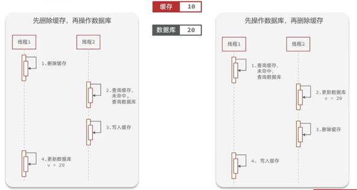
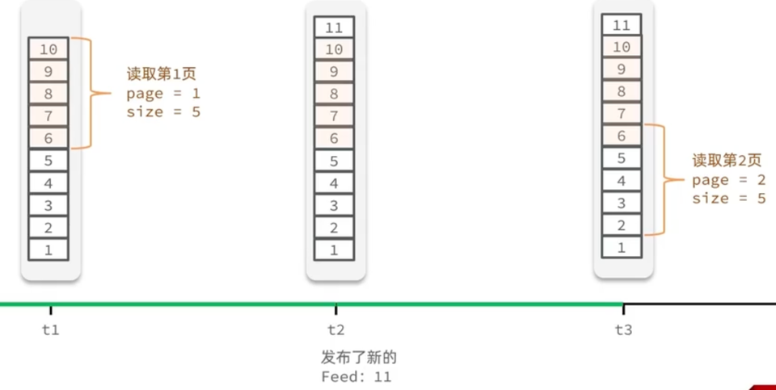

# 项目知识

## 回忆

### IOC

> Spring 的 IOC（Inversion of Control，控制反转） 是 Spring 框架的核心思想之一，
> 它的作用是将对象的创建和依赖关系的管理交给 Spring 容器，而不是在代码中手动管理。

对象（Bean）的创建与管理由 Spring 负责

### 依赖注入

构造函数注入：

```java
@Component
public class UserService {
    private final UserRepository userRepository;

    @Autowired
    public UserService(UserRepository userRepository) {
        this.userRepository = userRepository;
    }
}
```

依赖注入是用于创建 Bean 的

### 注解

- @Component 用于声明 Bean
  - @Controller 控制层
  - @Service 服务层
  - @Repository Dao 层
- @ComponentScan 用于指定去哪儿扫描 Bean
  - 在 SpringBoot 中，其会递归扫描 @SpringBootApplication 同软件包下的所有包
- @Resource @Autowired 用于依赖注入
- @Transactional 用于事务
  - 本质是 AOP 代理
  - 因此同一个类里调用一个事务，事务不会生效（因为拦截不到）。可以通过 Aspectj 拿到自己的代理来解决

### Mybatis-plus

```java
import com.baomidou.mybatisplus.annotation.TableId;
import com.baomidou.mybatisplus.annotation.TableName;
import lombok.Data;

@Data
@TableName("user")  // 对应数据库中的 `user` 表
public class User {
    @TableId  // 主键
    private Long id;
    private String name;
    private Integer age;
    private String email;
}
```

```java
import com.baomidou.mybatisplus.core.mapper.BaseMapper;
import org.apache.ibatis.annotations.Mapper;

@Mapper
public interface UserMapper extends BaseMapper<User> {
    // BaseMapper 已经提供了常见 CRUD 方法
    // save(), getById(), list()...
}
```

```java
import com.baomidou.mybatisplus.extension.service.IService;

public interface UserService extends IService<User> {
    // 可以扩展自定义业务逻辑方法
}
```

```java
import com.baomidou.mybatisplus.extension.service.impl.ServiceImpl;
import org.springframework.stereotype.Service;

@Service
public class UserServiceImpl extends ServiceImpl<UserMapper, User> implements UserService {
    // 直接继承 ServiceImpl，提供通用 CRUD
}
```

其直接内置了常用的 CRUD，还提供了强大的分页功能。

## 配置环境

1. 初始化时可以将 sql 脚本直接挂载到`/docker-entrypoint-initdb.d`，容器创建时会执行（保证 mysql_data 为空）
2. 挂载 nginx 时因为 html 挂载到不同的地方，所以要修改 conf。同时，conf `localhost:8081` 需要改为 `http://host.docker.internal:8081`
   - 其实用 `network_mode=host` 是更简单的方式
   - linux 安装 docker 后，会创建一个为 docker0 的虚拟网卡，linux 宿主机与 docker 容器之间的通信，通过 docker0 虚拟网卡进行
   - 但 MAC 的 docker 不支持，因为 MAC 上的 docker 是首先创建一个 linux 的虚拟机，将其跑到虚拟机里。。

## 短信登录

### 如何生成验证码？

课程里的第一个方法：生成一个 code 到 session 里 `session.setAttribute("code", xxx)`，随后登录的时候取出。但这个方法有很明显的 bug:

- 未将 code 和手机号绑定。所以在生成 code 的时候可以 `session.setAttribute("code:"+phone, xxx)`。
- 同时，相关验证码应该设置有效期，在校验完成后，也应该及时删除相关验证码。（对于字符验证码，还应该设置忽略大小写）
- session 只适用于单机，当分布式的时候，假设验证码存储到服务器 A 的 session，服务器 B 拿不到。
- 因此，用 Redis 是更好的选择

### DTO

> （Data Transfer Object，数据传输对象）是一种 用于在不同层（如 Controller、Service、DAO）之间传递数据的对象，
> 通常用于 封装用户数据，避免直接暴露数据库模型（如 User 实体类）。

一方面避免暴露所有字段，另一方面前端也不需要那么多字段。

## 缓存更新

低一致性需求：依赖 redis 的内存淘汰/定时
高一致性需求：主动更新，定时兜底

- 读操作：
  - 缓存命中返回
  - 未命中则查询数据库，并写入缓存，定时
- 写操作：
  - 先写数据库
  - 删除缓存

### 更新缓存还是删除缓存

写入缓存后该数据如果未被读取就是无效更新，所以采取删除缓存的方法。

### 先写数据库还是先删缓存



如图，分别是不一致的情况，先删除缓存出现问题的概率更大，因为更新数据库是一个较慢的操作。
而先写数据库的问题出现概率很小：正好缓存失效且在查询数据库的过程中更新数据库。

## 缓存穿透

> 缓存在 Redis 和 数据库都不存在，请求会打到数据库

解决方法：

1. 缓存空对象
   - 实现简单
   - 额外的内存消耗，短期不一致(如果缓存为空后，真的有该 id 的对象存在，则一直请求不到)
   - 200ms -> 20ms
2. Bloom Filter
   - 内存占用小
   - 存在误判可能
3. 增强 id 的复杂度，避免被猜测
   - 结合数据校验，可以直接排除一些请求
4. 加强用户权限
   - 一些 api 要求用户登录，或者权限用户

在本项目中使用方法 1，见`ShopServiceImpl.java`

## 缓存雪崩

> 大量 key 同时失效或者 Redis 服务挂了，导致大量请求到达数据库

解决方法：

1. 随机 TTL
2. Redis 集群
3. 降级限流
   - 黑马 SpringCloud
4. 多级缓存

## 缓存击穿

> 🔥 key 失效


一致性和可用性的 tradeoff：互斥锁保持一致性但线程需要等待；
逻辑过期不保证一致性但性能好

对于逻辑过期，一般都会先将数据预热，预先加载到 Redis

## 全局唯一 id

e.g. 当用户抢购优惠券时会生成订单保存到 `tb_voucher_order` 这张表中，
而订单表如果使用数据库自增 id，则

1. id 的规律太明显
2. 受单表数量限制（后续分表 id 重复）

使用全局 id 生成器：

1. 唯一
2. 递增
3. 安全
4. 高可用高性能

雪花算法：| 1bit 符号位 | 41bit 时间戳 | 10bit 机器 ID | 12bit 计数器 |
本项目使用 **Redis 自增** 的方案来保证全局 id。模仿雪花算法，取 32bit 的时间戳

## 超卖问题

e,g, 多线程并发下未加锁导致 100 份库存卖出多于 100 份的问题

解决方法：

1. 悲观锁
2. 乐观锁
   - 版本号法
   - CAS

## 一人一单

悲观锁，一个用户一个锁，集群下失效，需要**分布式锁**

## 分布式锁

分布式系统下多进程可见的锁，需要互斥，高可用，高性能等


本课程基于 Redis 实现分布式锁，

- 使用 `SETNX`，锁需要添加超时释放的机制，防止宕机之后锁一直不释放
  为了保证原子性，`SETNX EXPIRE` => `SET EX .. NX`
- 阻塞/非阻塞

### 问题

1. 超时后可能释放别人获取的锁，需要判断是否释放的是自己的锁（利用 uuid ）
2. 判断锁和释放锁不是一个原子性的动作
   

用 Lua 脚本解决

尽管如此还是存在许多问题：

1. 不可重入：同一线程无法多次获取同一把锁
2. 不可重试：获取失败就返回
3. 超时释放
4. 主从一致

## Redisson


尽管 Redisson 提供重入锁解决了很多 redis 分布式锁的坑，但仍然避免不了主从下主节点失效导致锁失效问题。强一致的情况可以 Zookeeper

## 秒杀优化

原先的秒杀流程，吞吐不高：


一方面，我们可以将判断库存和判断一人一单拿到 Redis 里去做，另一方面，创建订单可以异步执行


库存用 kv，而订单用集合保存用户来保证一人一单

## 消息队列

### 基于 List

- 利用 Redis 存储，不受限 JVM 内存
- 基于 Redis 持久化，数据安全
- 满足消息有序
- 无法避免消息丢失，只支持单消费者

### 基于 PubSub

- 采用发布订阅模型，支持多生产多消费
- 不支持数据持久化
- 无法避免消息丢失
- 消息堆积有上限，超时数据丢失

### 基于 Stream

- `XADD` `XREAD` 会漏读

消费者组：将多个消费者划分到一个组，监听同一个队列

- 消息分流：队列中的消息会分流给不同的消费者
- 消息标识：消费者组会维护最后一个被消费的消息标识，消息不会漏读
- 消息确认：消费者获取消息后，消息处于 pending 状态存入 pending-list。处理完成后需要 `XACK` 确认消息，消息才会被 pending-list 移除

- `XGROUP` 创建消费者组
- `XREADGROUP` 从消费者组读，可以读第一条未被读取的消息也可以读 pending-list 里的消息

- 可以多消费者，阻塞读，没有消息漏读的风险，有消息确认机制，确保消息至少被消费一次

## 发布探店笔记

## 点赞

需求：

- 同一个用户只能点赞一次，再次点击取消
  实现：
- Blog 添加 isLike 字段
- 利用 Redis 的 set 来判断是否点赞过

## 关注功能

- 共同关注：Redis 的 set 取交集
- 关注推送：Feed 流。通过无限下拉刷新获取新的信息

传统模式：用户寻找内容，Feed 模式：推送内容给用户

TimeLine：e.g.朋友圈

1. 拉模式（读扩散）
   - 每次读取都查询所有关注者的发件箱并进行拼接
   - 如果关注的人很多。。｜｜读效率低
2. 推模式（写扩散）
   - 将消息推送到所有粉丝的收件箱
   - 如果粉丝很多。。｜｜写效率低，内存占用高
3. 推拉结合
   - 普通人：推模式
   - 大 V：推模式给活跃粉丝，拉模式给普通粉丝

Feed 流的分页问题：



重复读了 6，因此不能采用传统的分页模式。使用 lastId


不使用 `ZRANGE`，根据分数进行查询 `ZRANGEBYSCORE`。拿到最小时间戳后，还需要记录
查询中最小时间戳重复的个数用于下一次查询的 offset

智能匹配：e.g. 抖音

## 附近商户


## 用户签到


## 统计次数


单个 Hyperloglog 内存永远小于 16 kb，测量有小于 0.81% 的误差

## Redis 主从架构

为了进一步提高 Redis 的并发能力，需要搭建主从集群，实现读写分离
